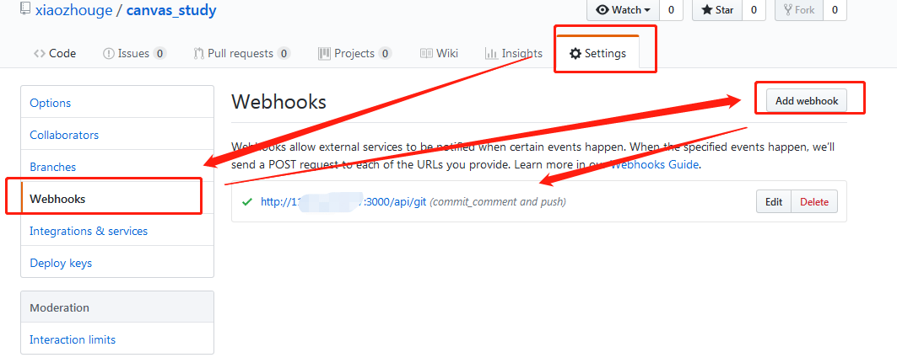
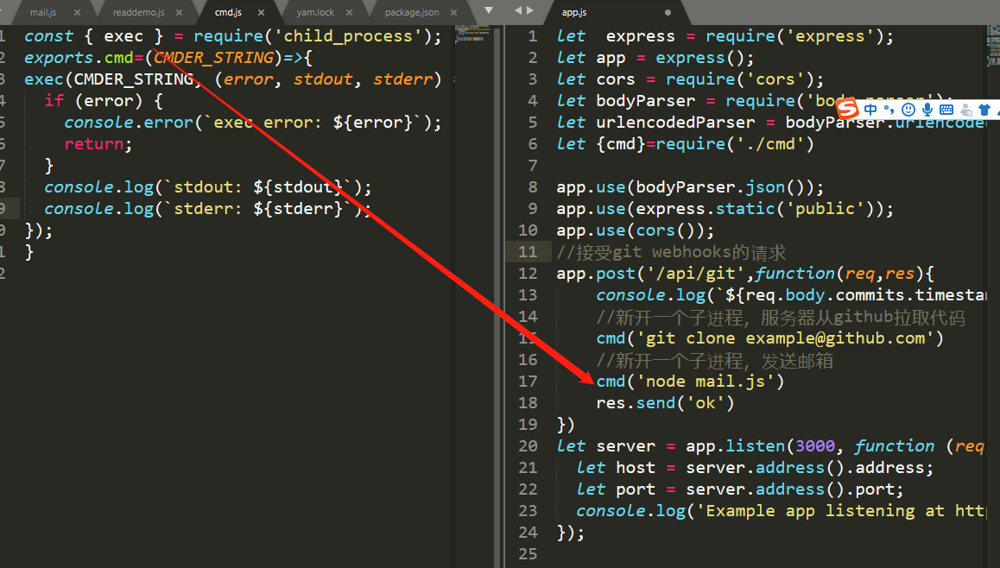
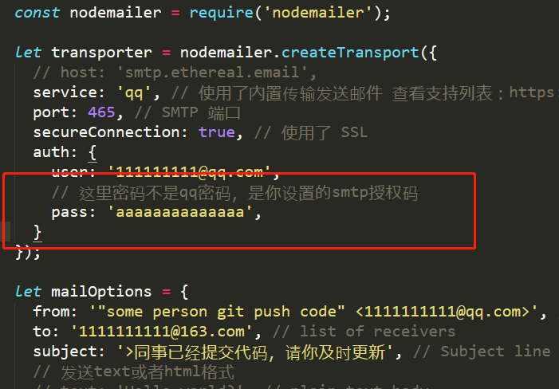
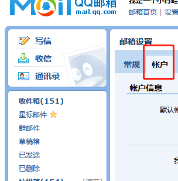

# node和webhooks的自动化部署，其实就是代码提交，然后服务器从github上拉取代码，这就是所谓的自动化部署

##  1.首先从github的webhooks配置一个请求，每提交代码，都会触发这个请求

##  2.服务器接受这个请求，就可以新开一个子进程(cmd.js)去运行shell,服务器得到的结果如下图

##  3.同时，可以运行一个shell,去运行一个node mail.js，给所有的同事发邮件

### 注意：
#### 1）邮件用的是nodemailer，里面涉及到一个SMTP(一种协议，用来身份认证)

#### 2）我用的是QQ邮箱给我的163邮箱发送的邮件，QQ邮箱需要这样开启

